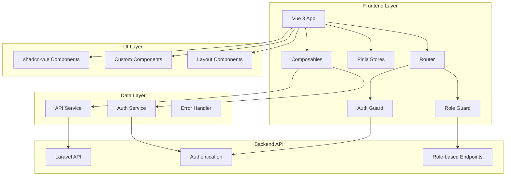

# Design Document

## Overview

The backend administration interface will be a comprehensive Vue 3 application that provides role-based management capabilities for the ecommerce platform. The design leverages the existing Vue 3 + TypeScript + Tailwind CSS stack with shadcn-vue components to create a modern, responsive, and intuitive admin dashboard.

The interface will serve three primary user roles (Admin, Editor, Moderator) with differentiated access levels and functionality. The design emphasizes usability, performance, and maintainability while ensuring secure integration with the Laravel API backend.

## Architecture

### High-Level Architecture



### Application Structure

```
src/
├── components/
│   ├── admin/           # Admin-specific components
│   ├── common/          # Shared components (existing)
│   ├── forms/           # Form components
│   ├── tables/          # Data table components
│   └── ui/              # shadcn-vue components (existing)
├── composables/
│   ├── useAdmin.ts      # Admin operations
│   ├── useAuth.ts       # Authentication (existing)
│   ├── useProducts.ts   # Product management (existing)
│   ├── useCategories.ts # Category management
│   ├── useTransactions.ts # Transaction management
│   ├── useUsers.ts      # User management
│   ├── useAuditTrail.ts # Audit trail operations
│   └── useStorage.ts    # File storage operations
├── stores/
│   ├── auth.ts          # Authentication store (existing)
│   ├── admin.ts         # Admin dashboard store
│   ├── users.ts         # User management store
│   ├── categories.ts    # Category management store
│   └── auditTrail.ts    # Audit trail store
├── views/
│   ├── admin/           # Admin dashboard views
│   ├── auth/            # Authentication views
│   ├── products/        # Product management views
│   ├── categories/      # Category management views
│   ├── transactions/    # Transaction management views
│   ├── users/           # User management views
│   ├── audit/           # Audit trail views
│   └── storage/         # File storage views
├── router/
│   ├── admin.ts         # Admin routes
│   ├── guards.ts        # Route guards
│   └── index.ts         # Main router (existing)
├── services/
│   ├── api/
│   │   ├── admin.ts     # Admin API calls
│   │   ├── users.ts     # User management API
│   │   ├── categories.ts # Category API
│   │   ├── transactions.ts # Transaction API
│   │   ├── auditTrail.ts # Audit trail API
│   │   └── storage.ts   # Storage API
│   └── auth.ts          # Authentication service
└── types/
    ├── admin.ts         # Admin-related types
    ├── user.ts          # User types
    ├── category.ts      # Category types
    ├── transaction.ts   # Transaction types
    ├── auditTrail.ts    # Audit trail types
    └── storage.ts       # Storage types
```

## Components and Interfaces

### Core Layout Components

#### AdminLayout.vue

- **Purpose**: Main layout wrapper for admin interface
- **Features**:
  - Responsive sidebar navigation
  - Header with user menu and notifications
  - Role-based navigation items
  - Breadcrumb navigation
- **Props**: None
- **Slots**: default (main content area)

#### AdminSidebar.vue

- **Purpose**: Navigation sidebar with role-based menu items
- **Features**:
  - Collapsible sidebar
  - Role-based menu filtering
  - Active route highlighting
  - Icon-based navigation
- **Props**: `collapsed: boolean`
- **Events**: `toggle-collapse`

#### AdminHeader.vue

- **Purpose**: Top header with user controls and notifications
- **Features**:
  - User profile dropdown
  - Logout functionality
  - Notification center
  - Search functionality
- **Props**: None
- **Events**: `logout`, `search`

### Data Management Components

#### DataTable.vue

- **Purpose**: Reusable data table with advanced features
- **Features**:
  - Sorting and filtering
  - Pagination
  - Bulk actions
  - Export functionality
  - Column customization
- **Props**:
  - `data: T[]`
  - `columns: TableColumn[]`
  - `loading: boolean`
  - `pagination: PaginationConfig`
- **Events**: `sort`, `filter`, `page-change`, `bulk-action`

#### FormBuilder.vue

- **Purpose**: Dynamic form generator with validation
- **Features**:
  - Schema-based form generation
  - Vee-validate integration
  - File upload support
  - Conditional field rendering
- **Props**:
  - `schema: FormSchema`
  - `initialValues: Record<string, any>`
- **Events**: `submit`, `change`

#### ImageUpload.vue

- **Purpose**: Multi-image upload component
- **Features**:
  - Drag and drop support
  - Image preview
  - Progress indicators
  - Validation feedback
- **Props**:
  - `multiple: boolean`
  - `maxFiles: number`
  - `acceptedTypes: string[]`
- **Events**: `upload`, `remove`

### Feature-Specific Components

#### ProductManager.vue

- **Purpose**: Complete product management interface
- **Features**:
  - Product CRUD operations
  - Image management
  - Category assignment
  - Stock tracking
  - Bulk operations

#### CategoryManager.vue

- **Purpose**: Category management with hierarchy support
- **Features**:
  - Tree view of categories
  - Drag and drop reordering
  - Product count display
  - Bulk operations

#### TransactionManager.vue

- **Purpose**: Transaction processing and management
- **Features**:
  - Status workflow management
  - Customer information display
  - Order item breakdown
  - Refund processing

#### UserManager.vue

- **Purpose**: User account and role management
- **Features**:
  - User CRUD operations
  - Role assignment
  - Permission management
  - Activity tracking

#### AuditTrailViewer.vue

- **Purpose**: System activity monitoring
- **Features**:
  - Activity timeline
  - Change comparison
  - Advanced filtering
  - Export capabilities

## Data Models

### User Interface Types

```typescript
// User Management
interface User {
  id: number
  name: string
  email: string
  role: UserRole
  email_verified_at: string | null
  created_at: string
  updated_at: string
  permissions: string[]
  statistics: UserStatistics
}

interface UserStatistics {
  total_products: number
  total_categories: number
  total_transactions: number
}

type UserRole = 'admin' | 'editor' | 'moderator' | 'customer'

// Product Management
interface Product {
  id: number
  name: string
  description: string | null
  price: number
  stock: number
  category_id: number | null
  user_id: number
  created_at: string
  updated_at: string
  deleted_at: string | null
  user: User
  category: Category | null
  images: ProductImage[]
}

interface ProductImage {
  id: number
  product_id: number
  image_path: string
  user_id: number
  created_at: string
  updated_at: string
  deleted_at: string | null
}

// Category Management
interface Category {
  id: number
  name: string
  description: string | null
  user_id: number
  created_at: string
  updated_at: string
  deleted_at: string | null
  user: User
  products: Product[]
}

// Transaction Management
interface Transaction {
  id: number
  user_id: number
  total_amount: number
  status: TransactionStatus
  notes: string | null
  created_at: string
  updated_at: string
  deleted_at: string | null
  user: User
  items: TransactionItem[]
}

interface TransactionItem {
  id: number
  transaction_id: number
  product_id: number
  quantity: number
  price: number
  total: number
  product: Product
}

type TransactionStatus =
  | 'pending'
  | 'processing'
  | 'shipped'
  | 'delivered'
  | 'cancelled'
  | 'refunded'

// Audit Trail
interface AuditTrail {
  id: number
  user_id: number
  model_type: string
  model_id: number
  action: AuditAction
  old_values: Record<string, any> | null
  new_values: Record<string, any> | null
  ip_address: string
  user_agent: string
  created_at: string
  updated_at: string
  user: User
}

type AuditAction = 'created' | 'updated' | 'deleted' | 'restored'

// Storage Management
interface StorageFile {
  id: number
  filename: string
  original_name: string
  mime_type: string
  size: number
  user_id: number
  created_at: string
  updated_at: string
  deleted_at: string | null
  user: User
  file_url: string
}
```

### API Response Types

```typescript
interface ApiResponse<T> {
  message?: string
  data: T
  success?: boolean
}

interface PaginatedResponse<T> {
  current_page: number
  data: T[]
  first_page_url: string
  from: number
  last_page: number
  last_page_url: string
  next_page_url: string | null
  path: string
  per_page: number
  prev_page_url: string | null
  to: number
  total: number
}

interface ValidationError {
  message: string
  errors: Record<string, string[]>
}
```

## Error Handling

### Error Handling Strategy

```typescript
// Global Error Handler
class ErrorHandler {
  static handle(error: any): void {
    if (error.response?.status === 401) {
      // Handle authentication errors
      this.handleAuthError()
    } else if (error.response?.status === 403) {
      // Handle authorization errors
      this.handleAuthorizationError()
    } else if (error.response?.status === 422) {
      // Handle validation errors
      this.handleValidationError(error.response.data)
    } else {
      // Handle general errors
      this.handleGeneralError(error)
    }
  }

  private static handleAuthError(): void {
    // Clear auth state and redirect to login
    useAuthStore().logout()
    router.push('/login')
  }

  private static handleAuthorizationError(): void {
    // Show permission denied message
    useNotifications().error('You do not have permission to perform this action')
  }

  private static handleValidationError(data: ValidationError): void {
    // Display validation errors
    Object.entries(data.errors).forEach(([field, messages]) => {
      messages.forEach((message) => {
        useNotifications().error(`${field}: ${message}`)
      })
    })
  }

  private static handleGeneralError(error: any): void {
    // Log error and show generic message
    console.error('Application Error:', error)
    useNotifications().error('An unexpected error occurred. Please try again.')
  }
}
```

### Form Validation

```typescript
// Validation Schemas using Zod
import { z } from 'zod'

export const productSchema = z.object({
  name: z.string().min(1, 'Product name is required').max(255),
  description: z.string().optional(),
  price: z.number().min(0, 'Price must be positive'),
  stock: z.number().int().min(0, 'Stock must be non-negative'),
  category_id: z.number().optional(),
  images: z.array(z.instanceof(File)).optional(),
})

export const categorySchema = z.object({
  name: z.string().min(1, 'Category name is required').max(255),
  description: z.string().max(1000).optional(),
})

export const userSchema = z.object({
  name: z.string().min(1, 'Name is required').max(255),
  email: z.string().email('Invalid email format'),
  password: z.string().min(8, 'Password must be at least 8 characters').optional(),
  role: z.enum(['admin', 'editor', 'moderator', 'customer']),
})

export const transactionUpdateSchema = z.object({
  status: z.enum(['pending', 'processing', 'shipped', 'delivered', 'cancelled', 'refunded']),
  notes: z.string().optional(),
})
```

## Testing Strategy

### Unit Testing

- **Framework**: Vitest
- **Coverage**: All composables, utilities, and business logic
- **Mocking**: API calls and external dependencies
- **Focus Areas**:
  - Authentication logic
  - Data transformation
  - Validation schemas
  - Error handling

### Component Testing

- **Framework**: Vue Test Utils + Vitest
- **Coverage**: All reusable components
- **Testing Approach**:
  - Props and events
  - User interactions
  - Conditional rendering
  - Accessibility compliance

### Integration Testing

- **Framework**: Cypress or Playwright
- **Coverage**: Critical user workflows
- **Test Scenarios**:
  - Login and authentication
  - Product management workflow
  - Transaction processing
  - User role permissions

### API Integration Testing

- **Approach**: Mock Service Worker (MSW)
- **Coverage**: All API endpoints
- **Focus Areas**:
  - Request/response handling
  - Error scenarios
  - Authentication flows
  - Role-based access

## Performance Considerations

### Code Splitting

```typescript
// Route-based code splitting
const AdminDashboard = () => import('@/views/admin/Dashboard.vue')
const ProductManager = () => import('@/views/admin/ProductManager.vue')
const UserManager = () => import('@/views/admin/UserManager.vue')
```

### Data Optimization

- **Pagination**: Implement virtual scrolling for large datasets
- **Caching**: Use Pinia with persistence for frequently accessed data
- **Lazy Loading**: Load images and heavy components on demand
- **Debouncing**: Implement search and filter debouncing

### Bundle Optimization

- **Tree Shaking**: Ensure unused code is eliminated
- **Dynamic Imports**: Load features on demand
- **Asset Optimization**: Compress images and optimize fonts
- **CDN Integration**: Serve static assets from CDN

## Security Considerations

### Authentication & Authorization

- **Token Management**: Secure storage and automatic refresh
- **Route Guards**: Role-based access control
- **API Security**: Include auth tokens in all requests
- **Session Management**: Handle token expiration gracefully

### Data Protection

- **Input Sanitization**: Validate and sanitize all user inputs
- **XSS Prevention**: Use Vue's built-in XSS protection
- **CSRF Protection**: Implement CSRF tokens for state-changing operations
- **File Upload Security**: Validate file types and sizes

### Privacy & Compliance

- **Data Minimization**: Only request necessary data
- **Audit Logging**: Track all administrative actions
- **Access Logging**: Monitor user access patterns
- **Data Retention**: Implement appropriate data retention policies
